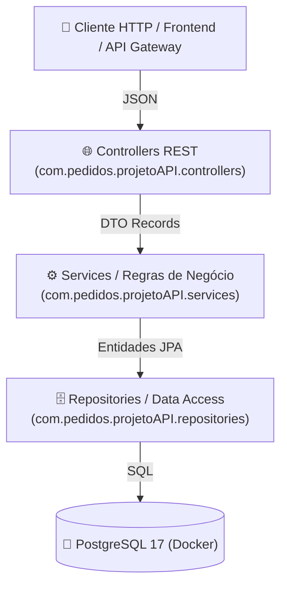
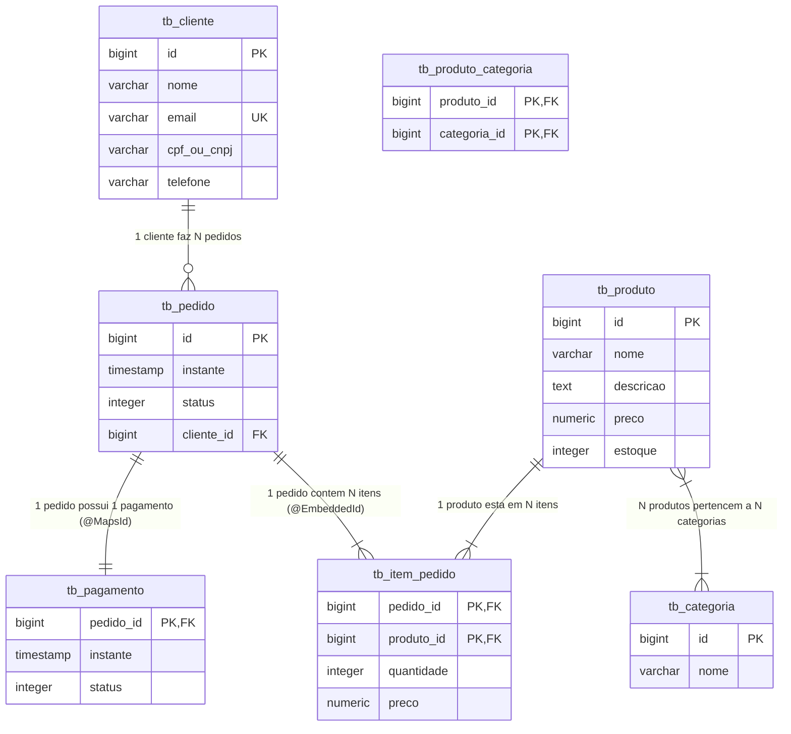

# 🛒 Order Management API

[](https://openjdk.org/)
[](https://spring.io/projects/spring-boot)
[](https://www.postgresql.org/)
[](https://www.docker.com/)

API RESTful para gerenciamento completo do ciclo de vida de pedidos em e-commerce (clientes, categorias, produtos, pedidos e pagamentos). Desenvolvida com arquitetura em camadas desacoplada, utilizando **Java 25**, **Spring Boot**, **Spring Data JPA / Hibernate**, containerização com **Docker** e DTOs imutáveis com **Java Records**.

---

## 📑 Sumário

- [Arquitetura do Sistema](#-arquitetura-do-sistema)
- [Modelo de Dados (ERD)](#-modelo-de-dados-erd)
- [Decisões de Design e Padrões](#-decisões-de-design-e-padrões)
- [Tecnologias Utilizadas](#-tecnologias-utilizadas)
- [Estrutura do Projeto](#-estrutura-do-projeto)
- [Como Executar a Aplicação](#-como-executar-a-aplicação)
  - [1. Infraestrutura Docker](#1-infraestrutura-docker)
  - [2. Inicialização da API](#2-inicialização-da-api)
- [Referência da API (Endpoints)](#-referência-da-api-endpoints)

---

## 🏗️ Arquitetura do Sistema

A aplicação segue uma **Arquitetura em Camadas (Layered Architecture)**, garantindo baixo acoplamento e alta coesão:



* **Camada Web (`controllers`)**: Responsável pelo roteamento HTTP, validações de entrada e padronização de respostas com códigos HTTP adequados (`200`, `201`, `204`).
* **Camada de Negócio (`services`)**: Centraliza as regras de negócio, cálculos de valores totais, validação de integridade e controle transacional atômico (`@Transactional`).
* **Camada de Acesso a Dados (`repositories`)**: Abstrai as operações de persistência por meio de interfaces que estendem `JpaRepository`.
* **Camada de Domínio (`entities`)**: Mapeamento objeto-relacional (ORM) das entidades de banco de dados.

---

## 🗄️ Modelo de Dados (ERD)

O modelo relacional é composto por 7 tabelas estruturadas para suportar pedidos, itens e pagamentos com precisão:



---

## 💡 Decisões de Design e Padrões

### 1. Padrão DTO com Java Records (Composição)
* **Prevenção de Fraudes:** Na criação de um pedido (`PedidoCreateDTO`), o cliente apenas informa o `clienteId` e a lista de itens (`produtoId` e `quantidade`). O preço unitário do produto é capturado diretamente do banco de dados no momento da transação, impossibilitando fraudes de valores.
* **Composição de DTOs:** O `PedidoDTO` agrega de forma limpa instâncias de `ClienteDTO`, `PagamentoDTO` e coleções de `ItemPedidoDTO`. Isso evita serializações cíclicas infinitas no Jackson e oculta detalhes sensíveis do modelo relacional.

### 2. Chave Primária Composta (`@EmbeddedId`)
A entidade `ItemPedido` implementa chave composta através da classe auxiliar `ItemPedidoPK` (`pedido_id` + `produto_id`), garantindo unicidade relacional entre o pedido e seus produtos.

### 3. Integridade e Compartilhamento de Chave (`@MapsId`)
A entidade `Pagamento` utiliza a anotação `@MapsId` para compartilhar a chave primária de `Pedido`. Isso assegura que um pagamento só existe quando estritamente vinculado a um pedido válido (relação 1:1 estrita).

### 4. Transações Atômicas (`@Transactional`)
A criação do pedido opera sob o princípio do "tudo ou nada": a persistência do pedido, associação de itens e histórico de preços acontecem em uma única transação com rollback automático em caso de exceção.

---

## 🛠️ Tecnologias Utilizadas

* **Linguagem:** Java 25
* **Framework:** Spring Boot
* **Módulos Spring:** Spring Data JPA, Spring Web MVC
* **Persistência / ORM:** Hibernate
* **Banco de Dados:** PostgreSQL 17
* **Containerização:** Docker & Docker Compose
* **Gerenciamento de Dependências:** Maven

---

## 📁 Estrutura do Projeto

```text
projetoAPI/
├── docker-compose.yml              # Orquestração do PostgreSQL 17 e pgAdmin 4
├── pom.xml                         # Configurações do Maven e dependências
└── src/main/java/com/pedidos/projetoAPI/
    ├── ProjetoApiApplication.java  # Classe inicializadora da aplicação
    ├── controllers/                # Endpoints REST (HTTP)
    │   ├── CategoriaController.java
    │   ├── ClienteController.java
    │   ├── PagamentoController.java
    │   ├── PedidoController.java
    │   └── ProdutoController.java
    ├── dtos/                       # Data Transfer Objects (Java Records)
    │   ├── CategoriaDTO.java
    │   ├── ClienteDTO.java
    │   ├── ItemPedidoCreateDTO.java
    │   ├── ItemPedidoDTO.java
    │   ├── PagamentoDTO.java
    │   ├── PedidoCreateDTO.java
    │   ├── PedidoDTO.java
    │   └── ProdutoDTO.java
    ├── entities/                   # Entidades de Domínio JPA
    │   ├── Categoria.java
    │   ├── Cliente.java
    │   ├── ItemPedido.java
    │   ├── Pagamento.java
    │   ├── Pedido.java
    │   ├── Produto.java
    │   ├── enums/                  # Enums de Status (Pedido e Pagamento)
    │   └── pk/                     # ItemPedidoPK (Chave Composta)
    ├── repositories/               # Interfaces Spring Data JPA
    │   ├── CategoriaRepository.java
    │   ├── ClienteRepository.java
    │   ├── ItemPedidoRepository.java
    │   ├── PagamentoRepository.java
    │   ├── PedidoRepository.java
    │   └── ProdutoRepository.java
    └── services/                   # Camada de Serviços e Regras de Negócio
        ├── CategoriaService.java
        ├── ClienteService.java
        ├── PagamentoService.java
        ├── PedidoService.java
        └── ProdutoService.java
```

---

## 🚀 Como Executar a Aplicação

### 1. Infraestrutura Docker

Suba os containers do banco de dados e pgAdmin com o comando:
```bash
docker compose up -d
```

| Serviço | Porta Externa | Porta Interna | Descrição |
| :--- | :---: | :---: | :--- |
| **PostgreSQL** | `5433` | `5432` | Banco de dados `order` com healthcheck nativo |
| **pgAdmin 4** | `15432` | `80` | Interface gráfica web para gerenciamento |

> **Observação:** As credenciais e configurações de ambiente podem ser customizadas no arquivo `docker-compose.yml` ou via variáveis de ambiente.

### 2. Inicialização da API

Com o banco ativo e saudável, execute a aplicação Spring Boot:
```bash
./mvnw spring-boot:run
```
A API estará acessível em: `http://localhost:8081`

---

## 📌 Referência da API (Endpoints)

### Categorias (`/categorias`)
| Método | Endpoint | Descrição | Status Sucesso |
| :---: | :--- | :--- | :---: |
| `GET` | `/categorias` | Lista todas as categorias cadastradas | `200 OK` |
| `GET` | `/categorias/{id}` | Busca uma categoria por ID | `200 OK` |
| `POST` | `/categorias` | Cadastra uma nova categoria | `201 Created` |
| `PUT` | `/categorias/{id}` | Atualiza uma categoria existente | `200 OK` |
| `DELETE`| `/categorias/{id}` | Remove uma categoria | `204 No Content` |

### Clientes (`/clientes`)
| Método | Endpoint | Descrição | Status Sucesso |
| :---: | :--- | :--- | :---: |
| `GET` | `/clientes` | Lista todos os clientes cadastrados | `200 OK` |
| `GET` | `/clientes/{id}` | Busca um cliente por ID | `200 OK` |
| `POST` | `/clientes` | Cadastra um novo cliente | `201 Created` |
| `PUT` | `/clientes/{id}` | Atualiza os dados de um cliente | `200 OK` |
| `DELETE`| `/clientes/{id}` | Remove um cliente | `204 No Content` |

### Produtos (`/produtos`)
| Método | Endpoint | Descrição | Status Sucesso |
| :---: | :--- | :--- | :---: |
| `GET` | `/produtos` | Lista todos os produtos com suas categorias | `200 OK` |
| `GET` | `/produtos/{id}` | Busca um produto por ID | `200 OK` |
| `POST` | `/produtos` | Cadastra um produto vinculado a categorias | `201 Created` |
| `PUT` | `/produtos/{id}` | Atualiza dados e categorias do produto | `200 OK` |
| `DELETE`| `/produtos/{id}` | Remove um produto | `204 No Content` |

### Pedidos (`/pedidos`)
| Método | Endpoint | Descrição | Status Sucesso |
| :---: | :--- | :--- | :---: |
| `GET` | `/pedidos` | Lista todos os pedidos com seus itens e totais | `200 OK` |
| `GET` | `/pedidos/{id}` | Busca detalhes completos de um pedido | `200 OK` |
| `POST` | `/pedidos` | Registra novo pedido a partir de `clienteId` e `itens` | `201 Created` |
| `PATCH`| `/pedidos/{id}/status?status=PAGO` | Atualiza o status do pedido manualmente | `200 OK` |

### Pagamentos (`/pagamentos`)
| Método | Endpoint | Descrição | Status Sucesso |
| :---: | :--- | :--- | :---: |
| `GET` | `/pagamentos/{id}` | Consulta o status de um pagamento por ID | `200 OK` |
| `POST` | `/pagamentos/pedido/{pedidoId}` | Processa o pagamento e atualiza o pedido para `PAGO` | `201 Created` |
